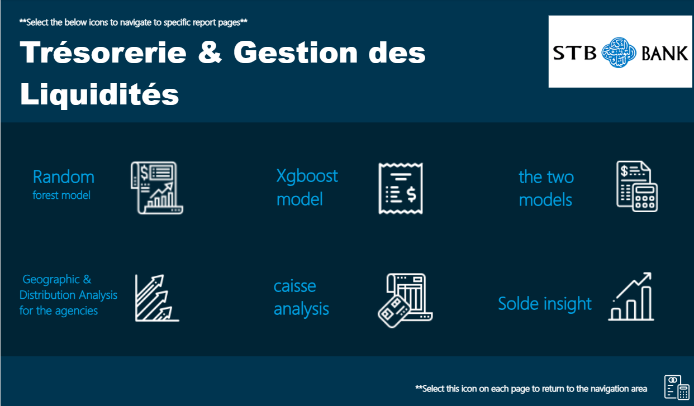
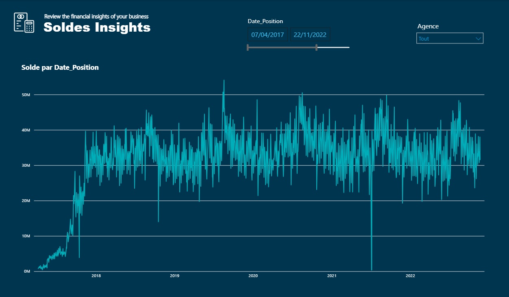
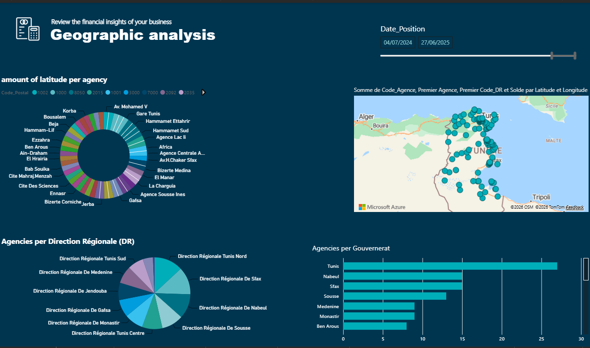
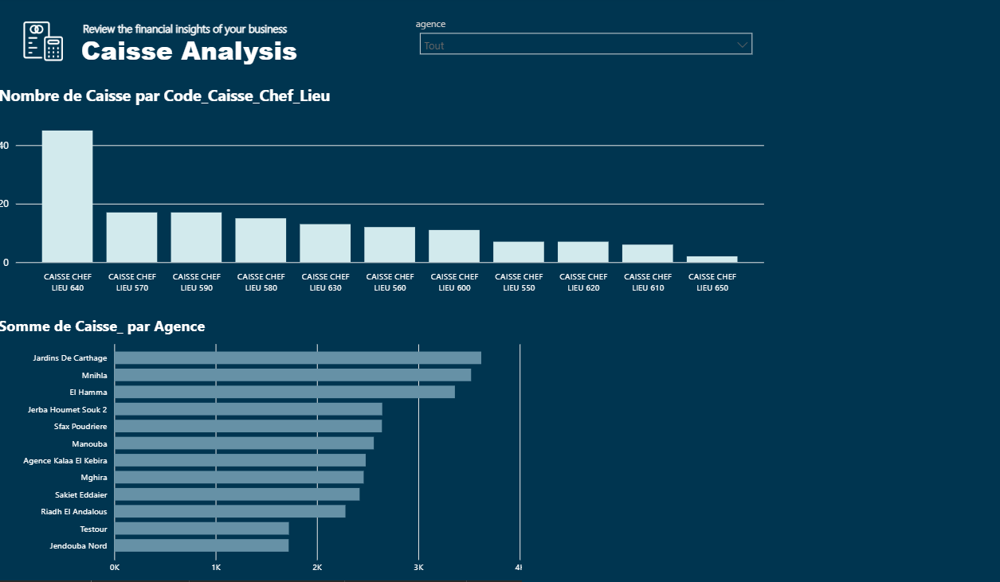
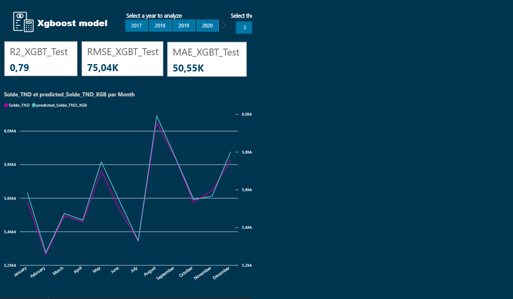
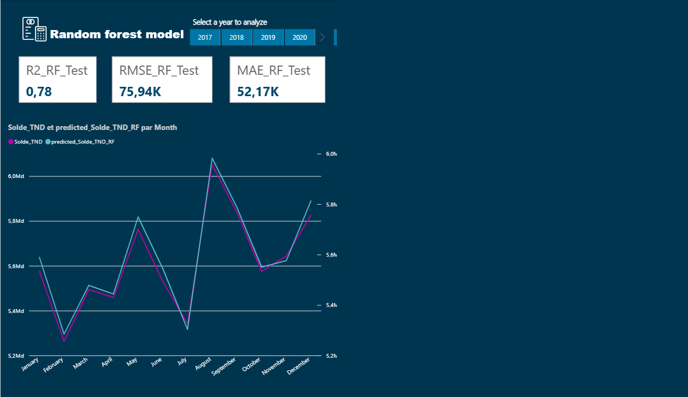
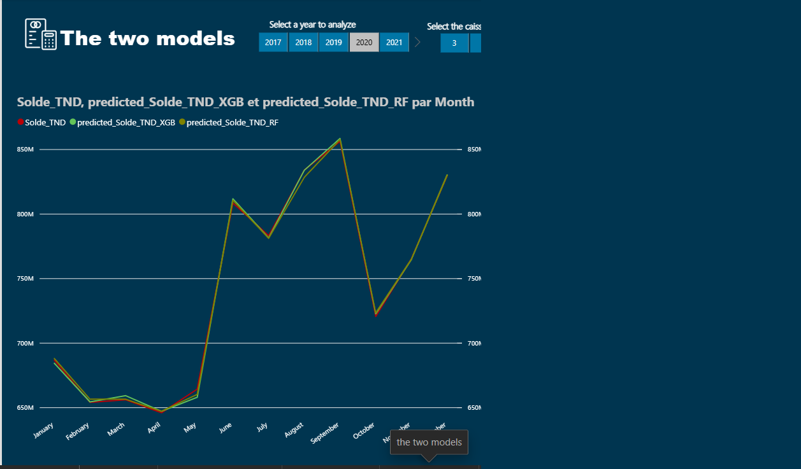

# Predictive Optimization of Treasury & Liquidity Flows — STB Bank

Internship project (Data/BI Analyst Intern, STB Bank, Summer 2025): a
predictive-modeling pipeline that forecasts daily cash-register liquidity
across bank branches, built on a proper dimensional (star-schema) data
warehouse and feeding a Power BI dashboard for treasury monitoring.


## Context

During a 1.5-month internship at **STB Bank** (Société Tunisienne de
Banque), I worked on predictive optimization of treasury and liquidity
flows across the bank's branch network — building predictive models from
real financial and banking data to help anticipate cash-register liquidity
needs at the branch level, using Python for data preparation, statistical
analysis, and dimensional modeling.

## ⚠️ About the data in this repo

This project was built and run against **real internal STB Bank data**:
daily cash-register balances, branch identifiers, and branch-manager
records. That data is confidential banking information and is
**intentionally not included** in this repository — no CSVs, no Power BI
file, no internship administrative documents. Only the analysis code
(sanitized of any real output) and this write-up are published.

The notebook (`treasury_liquidity_forecasting.ipynb`) documents the full
pipeline end to end and is reproducible against any dataset matching the
schema described below.

## The data model

The pipeline consumes a small star schema:

- **Fact table** — `Solde_TND` (cash balance in Tunisian dinars) and
  related balance fields (`Solde_Effet`, `Montant_Bloque`,
  `Solde_Mutiles`, `Solde_Timbres`), one row per cash register
  (`Caisse_Key`) per day (`Date_Position`).
- **`dim_caisse`** — maps each cash register to its branch (`Code_Agence`)
  and register type.
- **`dim_agence`** — branch reference data (code, region, governorate).
- **`dim_date`** — a standard date dimension (year, month, day, day of
  week, weekend/holiday flags).

The fact and dimension tables are merged into a single modeling table,
then reduced to the columns actually useful for forecasting (dropping
redundant/administrative columns picked up in the joins).

## Feature engineering

Because this is a per-register daily time series, the features are built
around recent history rather than static attributes:

- `lag_1`, `lag_7` — the register's balance 1 and 7 days prior.
- `rolling_mean_3` — 3-day rolling average balance.
- `rolling_std_7` — 7-day rolling volatility.
- Calendar features (`annee`, `mois`, `jour`, encoded day-of-week).
- `Gouvernerat` (governorate), label-encoded, as a coarse regional signal.

All lag/rolling features are computed **within each `Caisse_Key` group**
(via `groupby`), so no register ever leaks information from another
register, and a chronological train/test split is taken **per register**
(the first ~70% of each register's history for training, the rest for
testing) rather than a single global date cutoff — this keeps every
register represented in both sets despite branches having different
history lengths.

## Models

Two regressors are trained and compared on the same train/test split:

- **XGBoost Regressor** (`n_estimators=100`, `max_depth=6`,
  `learning_rate=0.1`)
- **Random Forest Regressor** (`n_estimators=100`, `max_depth=10`)

Both are evaluated with R², MAE, and RMSE on the held-out test portion of
each register's history, and both are used to generate predicted-vs-actual
comparison plots for individual registers. Since the metrics depend on the
confidential dataset, exact scores aren't published here — running the
notebook against the real (or an equivalent) dataset reproduces them
directly.

## From notebook to dashboard

The final step exports a combined table — actual balances, train/test
flags, and both models' predictions, per register per day — to Excel/CSV,
which feeds a **Power BI dashboard** ("Trésorerie & Gestion des
Liquidités") used to monitor treasury and liquidity positions across
branches. The dashboard file itself isn't published here for the same
confidentiality reason as the raw data.

## Dashboard

The final predictions feed a Power BI report used to monitor treasury and
liquidity positions across branches. Screenshots below show the report's
navigation and a few of its pages; exact balance figures and per-register
detail tables have been cropped out for confidentiality, leaving the
aggregate charts and model performance metrics.

| | |
|---|---|
|  |  |
|  |  |
|  |  |
|  | |

## Tools

Python (pandas, NumPy), scikit-learn, XGBoost, matplotlib/seaborn for
exploration and diagnostic plots, Power BI for the reporting layer.

## Project structure

```
.
├── treasury_liquidity_forecasting.ipynb   the full pipeline: load, clean,
│                                            engineer features, train, evaluate
├── requirements.txt
└── README.md
```

## Running it

```bash
python -m venv venv
source venv/bin/activate       # venv\Scripts\activate on Windows
pip install -r requirements.txt
jupyter notebook treasury_liquidity_forecasting.ipynb
```

You'll need data matching the schema above (fact table + the three
dimension tables) — this repo intentionally ships the pipeline, not the
data.

## Disclaimer

This is a portfolio write-up of an internship project. No confidential
STB Bank data, dashboards, or internal documents are included. Company
and individual references have been kept to what's already public in the
author's academic/professional record.

## License

MIT — see [LICENSE](LICENSE).
